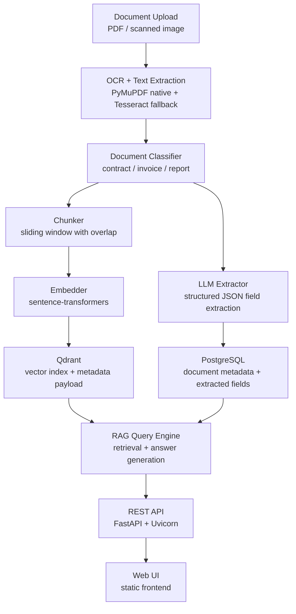

# document-intelligence-pipeline

A document processing system that extracts structured data and enables semantic search over business documents (contracts, invoices, financial reports). Built with FastAPI, Qdrant, and an OpenAI-compatible LLM, following RAG (Retrieval-Augmented Generation) patterns.

---

## Problem Statement

Business documents are often unstructured or semi-structured: contracts with key dates buried in paragraphs, invoices in varying formats, reports requiring manual extraction of figures. Manually processing these at scale is slow, error-prone, and doesn't scale.

This project automates the ingestion-to-query lifecycle: upload a document, extract structured fields via LLM, chunk and embed the content for retrieval, and ask natural language questions with grounded, cited answers. It reflects a class of data engineering problems increasingly common in enterprise settings — bridging traditional document management with vector-based retrieval infrastructure.

---

## Architecture



**Two complementary storage layers:**

- **PostgreSQL** — document metadata, extracted structured fields, query history, versioning
- **Qdrant** — vector index for semantic similarity search and RAG-based retrieval

**Document processing flow:**
1. Upload triggers OCR (PyMuPDF for native PDFs, Tesseract for scanned documents)
2. Classifier identifies document type to apply the correct field extraction schema
3. Chunks are embedded and indexed in Qdrant with document metadata as payload
4. LLM extracts structured fields (dates, amounts, parties) and stores results in PostgreSQL
5. Query requests retrieve relevant chunks from Qdrant, then generate grounded answers via LLM

---

## Tech Stack

| Component | Technology | Why |
|-----------|-----------|-----|
| API | FastAPI + Uvicorn | Async-first, type-safe, OpenAPI docs generated automatically |
| Relational DB | PostgreSQL + SQLAlchemy 2.0 | Structured metadata, extracted fields, query history |
| Vector Store | Qdrant | Purpose-built vector DB with payload filtering and production-ready scaling |
| OCR | PyMuPDF + Tesseract | Native PDF text extraction with scanned document fallback |
| Embeddings | sentence-transformers | Local embedding generation — no external API dependency or cost |
| LLM | OpenAI-compatible API | Structured field extraction and answer generation (works with Ollama locally) |
| Migrations | Alembic | Version-controlled schema changes |
| Containers | Docker + Docker Compose | Full-stack reproducible environment |
| CI/CD | GitHub Actions | Lint and test on every push |

**Why Qdrant over pgvector?** Qdrant is purpose-built for vector search with first-class support for payload filtering, collection management, and horizontal scaling. When queries combine vector similarity with metadata filters (e.g., "find clauses in contracts from 2023"), Qdrant handles this natively and efficiently.

---

## Prerequisites

- Docker Desktop (or Docker Engine + Compose plugin)
- Python 3.11+
- OpenAI API key or compatible endpoint (e.g., [Ollama](https://ollama.ai) for fully local usage)
- Optional: `uv` package manager (faster than pip/poetry)

---

## How to Run

```bash
# 1. Clone and configure
git clone https://github.com/adrianopsf/document-intelligence-pipeline.git
cd document-intelligence-pipeline
cp .env.example .env      # set OPENAI_API_KEY, DB credentials, Qdrant config

# 2. Start all services (PostgreSQL + Qdrant + API)
make up

# 3. Run database migrations
make migrate

# 4. Access the API and interactive docs
open http://localhost:8000/docs

# 5. Run the test suite
make test
```

To use Ollama instead of OpenAI, set `OPENAI_BASE_URL=http://host.docker.internal:11434/v1` and `OPENAI_API_KEY=ollama` in `.env`.

### Available Make targets

| Target | Description |
|--------|-------------|
| `make up` | Start all services via Docker Compose |
| `make down` | Stop all services |
| `make migrate` | Apply Alembic database migrations |
| `make test` | Run pytest suite (unit + integration) |
| `make lint` | Run linter |
| `make logs` | Tail service logs |

---

## Project Structure

```
.
├── .github/
│   └── workflows/          CI: lint + pytest on every push
├── src/docai/
│   ├── api/                FastAPI routers: upload, search, extract, query, export
│   ├── pipeline/           Core processing: OCR, chunking, embedding, LLM extraction
│   ├── models/             SQLAlchemy ORM models
│   ├── services/           Business logic — orchestrates pipeline components
│   └── config.py           Environment-based configuration (Pydantic Settings)
├── frontend/               Static web UI for document upload and Q&A
├── tests/                  Unit tests (pipeline components) + integration tests (API)
├── alembic/                Database migration scripts and env config
├── data/
│   └── samples/            Sample documents for local testing
├── docs/                   Architecture diagrams and API reference
├── .env.example            Environment variable template (no secrets committed)
├── docker-compose.yml      Service definitions: API, PostgreSQL, Qdrant
├── Dockerfile              API service container definition
└── pyproject.toml          Project config, dependency groups, tool settings
```

---

## API Endpoints

| Method | Endpoint | Description |
|--------|----------|-------------|
| `POST` | `/documents/upload` | Upload a document and trigger full processing pipeline |
| `GET` | `/documents/{id}` | Retrieve document metadata and extracted structured fields |
| `POST` | `/search` | Semantic search across all indexed document chunks |
| `POST` | `/query` | RAG-powered Q&A — returns answers with source citations |
| `GET` | `/export/{id}` | Export extracted document data as JSON or CSV |

Full interactive documentation available at `http://localhost:8000/docs` when running locally.

---

## What I Learned / Next Steps

**What I learned building this:**

- How relational and vector storage complement each other in the same system — PostgreSQL handles structured lookups and audit trails; Qdrant handles unstructured similarity retrieval
- The practical trade-offs in chunking strategy: smaller chunks improve retrieval precision but increase index size; larger chunks provide more context to the LLM but reduce recall
- How Alembic migrations interact with SQLAlchemy models in a Docker-based environment — particularly the importance of running migrations as a separate step from container startup

**What I'd add in a production environment:**

- An async task queue (Celery or ARQ) to process document uploads in the background — currently the upload endpoint is synchronous and blocks on long documents
- Document versioning: re-process and re-index when the embedding model or extraction schema is updated
- User-level access control on document collections, with JWT-based authentication on the FastAPI routes
- Batch embedding processing to replace the current per-chunk synchronous calls — would significantly improve throughput for bulk document ingestion

---

*Supports: PDF (native text), scanned PDFs (OCR), multi-page documents*
*Compatible LLMs: OpenAI API, Azure OpenAI, Ollama (local)*
